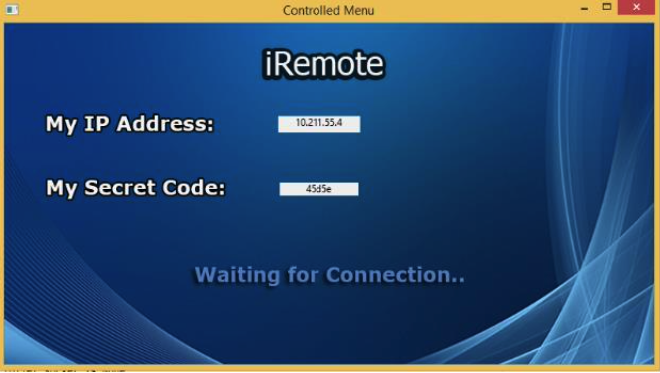
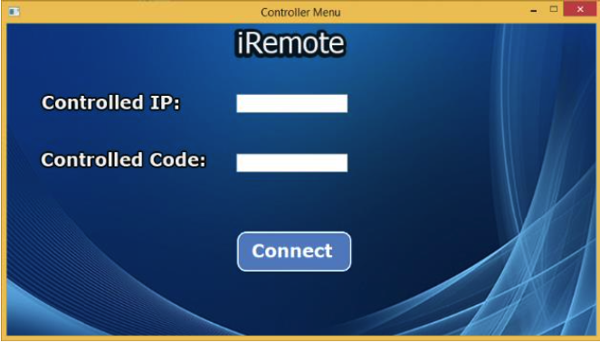

<!-- PROJECT SHIELDS -->
<!--
*** I'm using markdown "reference style" links for readability.
*** Reference links are enclosed in brackets [ ] instead of parentheses ( ).
*** See the bottom of this document for the declaration of the reference variables
*** for contributors-url, forks-url, etc. This is an optional, concise syntax you may use.
*** https://www.markdownguide.org/basic-syntax/#reference-style-links
-->

<!-- PROJECT LOGO -->
<br />
<p align="center">
  <a>
    
  </a>

  <h3 align="center">iRemote</h3>

  <p align="center">
    Easliy connect and control your acquaintance's computer, in order to help them solve techincal problems.
    <br />
    <br />
    <a href="https://streamable.com/4rs9fd">View Demo</a>
  </p>
</p>

<!-- TABLE OF CONTENTS -->
<details open="open">
  <summary>Table of Contents</summary>
  <ol>
    <li>
      <a href="#about-the-project">About The Project</a>
      <ul>
        <li><a href="#built-with">Built With</a></li>
      </ul>
    </li>
    <li>
      <a href="#getting-started">Getting Started</a>
      <ul>
        <li><a href="#installation">Installation</a></li>
      </ul>
    </li>
    <li><a href="#usage">Usage</a></li>
    <li><a href="#contact">Contact</a></li>
    <li><a href="#acknowledgements">Acknowledgements</a></li>
  </ol>
</details>


<!-- ABOUT THE PROJECT -->
## About The Project

<p align="center">
    

This simple application let users to control another computer remotely, mainly intended to make troubleshooting easier.
<br />
The software enables quick file transfer by dragging files from the controller computer to the controlled one.
<br />
It also contains Smart Clipboard: copy content in one computer and paste it in the other.        


### Built With

* [Socket](https://docs.python.org/3/library/socket.html)
* [PyAutoGUI](https://docs.python.org/3/library/socket.html)
* [wxPython](https://www.wxpython.org)

<!-- GETTING STARTED -->
## Getting Started

To get a local copy up and running follow these simple example steps.
<br />
The project is built with Python 2.7.

### Installation

1. Clone the repo
   ```sh
   git clone https://github.com/bar-kalandarov/iRemote.git
   ```
2. Use the package manager pip to install the following packages.

* Install jsonpickle packages
   ```sh
   pip install jsonpickle
   ```
* Install wx packages
   ```sh
   pip install wxpython
   ```
* Install pyHook packages
   ```sh
   pip install pyHook
   ```
* Install pywin32 packages
   ```sh
   pip install pywin32
   ```
* Install cStringIO packages
   ```sh
   pip install cStringIO
   ```
* Install numpy packages
   ```sh
   pip install numpy
   ```
* Install PyAutoGUI packages
   ```sh
   pip install pyautogui
   ```

<!-- USAGE EXAMPLES -->
## Usage
To start the program, the users have to run <b>ControllerMenu.py</b> and <b>ControlledMenu.py</b> on different computers.
<p align="center">

<br />
<br />

</p>

<br />

Then the controller user has to fill the required deatils, which are being showed to the controlled user.
<br />
Here is a short video showing basic use of the software and all of it's functions:

https://user-images.githubusercontent.com/82671706/127203877-d845d10f-f029-45ee-b885-78d8cbec2b7d.mp4

<!-- CONTACT -->
## Contact

Bar Kalandarov - [Linkedin](https://www.linkedin.com/in/bar-kalandarov/) - barkalandarov@gmail.com

Project Link: [https://github.com/bar-kalandarov/iRemote](https://github.com/bar-kalandarov/iRemote)


<!-- ACKNOWLEDGEMENTS -->
## Acknowledgements
* [jsonpickle](https://jsonpickle.github.io)
* [wxPython](https://www.wxpython.org)
* [pyHook](https://pypi.org/project/pyHook/)
* [pywin32](https://pypi.org/project/pywin32/)
* [io](https://docs.python.org/3/library/io.html)
* [numpy](https://numpy.org)
* [PyAutoGUI](https://pyautogui.readthedocs.io/en/latest/)
* [win32clipboard](http://timgolden.me.uk/pywin32-docs/win32clipboard.html)

<!-- MARKDOWN LINKS & IMAGES -->
<!-- https://www.markdownguide.org/basic-syntax/#reference-style-links -->
[contributors-shield]: https://img.shields.io/github/contributors/othneildrew/Best-README-Template.svg?style=for-the-badge
[contributors-url]: https://github.com/othneildrew/Best-README-Template/graphs/contributors
[forks-shield]: https://img.shields.io/github/forks/othneildrew/Best-README-Template.svg?style=for-the-badge
[forks-url]: https://github.com/othneildrew/Best-README-Template/network/members
[stars-shield]: https://img.shields.io/github/stars/othneildrew/Best-README-Template.svg?style=for-the-badge
[stars-url]: https://github.com/othneildrew/Best-README-Template/stargazers
[issues-shield]: https://img.shields.io/github/issues/othneildrew/Best-README-Template.svg?style=for-the-badge
[issues-url]: https://github.com/othneildrew/Best-README-Template/issues
[license-shield]: https://img.shields.io/github/license/othneildrew/Best-README-Template.svg?style=for-the-badge
[license-url]: https://github.com/othneildrew/Best-README-Template/blob/master/LICENSE.txt
[linkedin-shield]: https://img.shields.io/badge/-LinkedIn-black.svg?style=for-the-badge&logo=linkedin&colorB=555
[linkedin-url]: https://linkedin.com/in/bar-kalandarov
[product-screenshot]: images/screenshot.png
